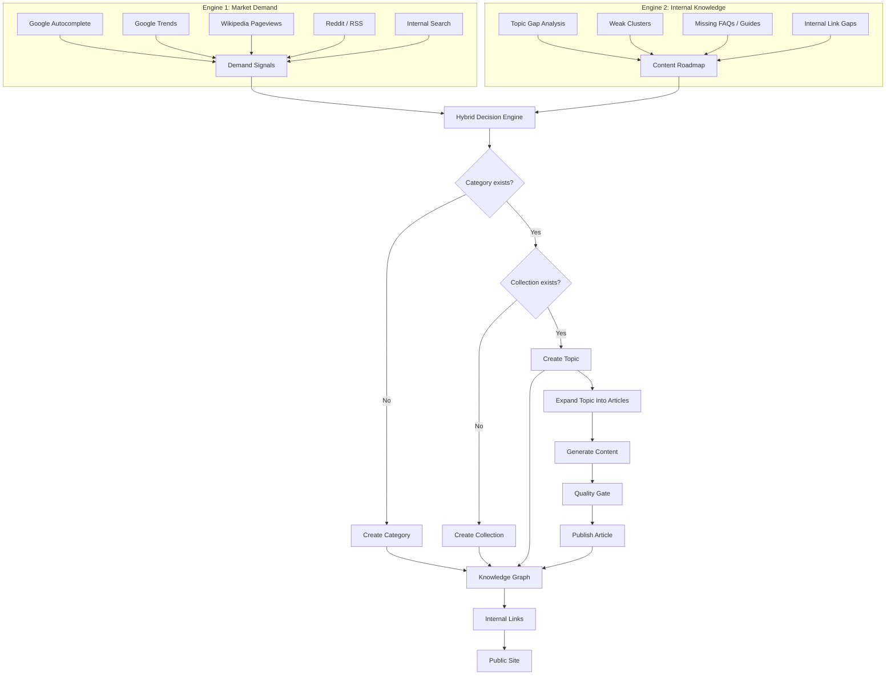

# Valendiro V1 Core Architecture

## Architecture Freeze

The V1 architecture is now complete. Valendiro is a **self-growing knowledge platform** with two independent engines driving a single publishing pipeline.

## High-level Diagram

## Core Principles

1. **Topics are the central object.** Articles belong to topics, never exist in isolation.
2. **Hierarchy is explicit:** `Category → Collection → Topic → Article`.
3. **Internal links follow the hierarchy** to build topical authority.
4. **Every article passes a quality gate:** duplicate, readability, and internal similarity checks.
5. **No manual topic planning:** Market demand + knowledge gaps decide what to publish next.
6. **Public search is only for visitors:** It never drives the publishing engine.

## Key Components

| Component | Responsibility | File |
|---|---|---|
| Demand discovery | External signals (Google, Wikipedia, Reddit) | `services/demand/externalDemandSources.ts` |
| Clustering | Group signals into clusters and auto-create categories/collections | `services/demand/topicClustering.ts` |
| Topic queue | Filter duplicates, cannibalization, quality | `services/demand/demandTopicQueue.ts` |
| Topic publishing | Create topic from queue and expand into articles | `services/demand/autonomousPublishingEngine.ts` |
| Topic expansion | Generate supporting article titles | `services/demand/topicExpansionEngine.ts` |
| Quality gate | Duplicate, readability, internal similarity | `services/seo/qualityGate.ts` |
| Hierarchical links | Category ↔ Collection ↔ Topic ↔ Article | `services/intelligence/hierarchicalLinkingEngine.ts` |
| Public data | Dynamic fetchers for pages | `services/public/publicData.ts` |
| Public pages | Dynamic homepage, category, collection, topic, article | `app/(public)/[lang]/...` |
