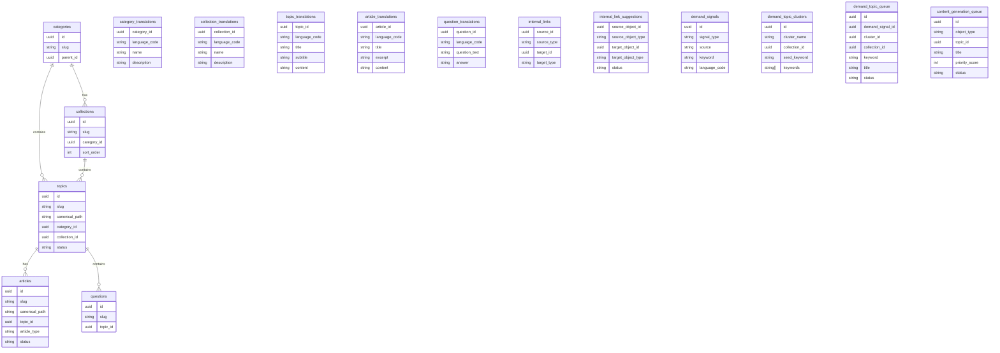

# Valendiro V1 Database Relationship Diagram

## Entity Relationship Diagram

## Key Relationships

- **Category → Collection** (1:N): A category has many collections.
- **Category → Topic** (1:N): A category also directly contains topics.
- **Collection → Topic** (1:N): A collection contains many topics.
- **Topic → Article** (1:N): A topic expands into many articles.
- **Topic → Question** (1:N): A topic has many FAQ questions.
- **Article → Topic** (N:1): Every article belongs to one topic.
- **Internal Links** (M:N): Links between any knowledge object, including category and collection.
- **Demand Signals** → Clusters → Queue → Generation Queue: Autonomous pipeline tracking.

## New V1 Columns

| Table | New Column | Purpose |
|---|---|---|
| `topics` | `collection_id` | FK to `collections` |
| `articles` | `topic_id` | FK to `topics` |
| `collections` | `category_id` | FK to `categories` |
| `demand_topic_clusters` | `collection_id` | Track generated collection |
| `demand_topic_queue` | `collection_id` | Track target collection |
| `content_generation_queue` | `topic_id` | Link article jobs to their topic |

## Internal Link Object Types

`source_type` / `target_type` now support:
- `category`
- `collection`
- `topic`
- `article`
- `question`
- `entity`
- `knowledge_object`
