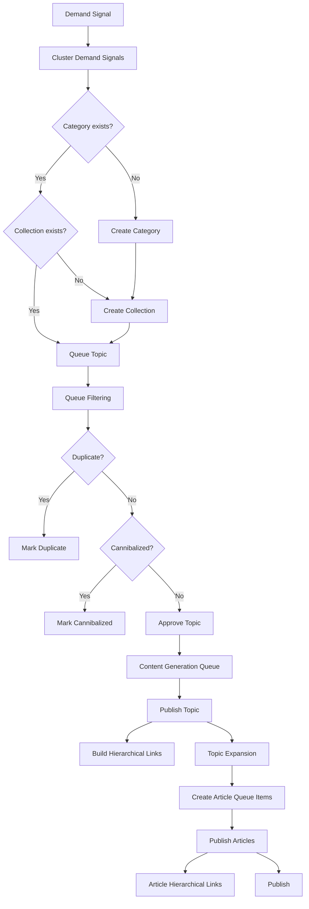

# Valendiro V1 Complete Publishing Pipeline

## Pipeline Steps

### 1. Demand Discovery
Sources: Google Autocomplete, Google Trends, Wikipedia Pageviews, Reddit, RSS, internal search.
Stored in `demand_signals`.

### 2. Clustering & Auto-Categorization
`clusterDemandSignals()` groups signals by keyword similarity using Jaccard similarity.
For each cluster with 2+ members:
- Reuse or create a `Category`.
- Reuse or create a `Collection` under the category.
- Store the cluster in `demand_topic_clusters` with `collection_id`.

### 3. Topic Queue & Filtering
`buildDemandTopicQueue()` checks each cluster against:
- Exact duplicates of existing topics or queued keywords.
- High-overlap (cannibalized) keywords.
Approved items become `pending` rows in `demand_topic_queue` with `collection_id`.

### 4. Topic Promotion
`approveDemandTopicQueueItems()` moves top pending items into `content_generation_queue` with `object_type = 'topic'`.

### 5. Topic Publishing
`publishApprovedTopics()` creates a `Topic` row with `category_id` and `collection_id`, then inserts a `topic_translations` row.
Immediately after, it calls `buildHierarchicalLinksForTopic()`.

### 6. Topic Expansion
`queueArticleExpansionsForTopic()` generates a set of supporting article titles (e.g., “Best X”, “Buying Guide”, “FAQ”, “Common Mistakes”) and inserts them into `content_generation_queue` with `object_type = 'article'` and `topic_id`.

### 7. Article Publishing
`publishApprovedArticles()`:
- Picks an article template based on `metadata.article_type`.
- Generates content via `generateArticleFromTemplate()`.
- Humanizes the content.
- Runs the quality gate (`duplicate`, `readability`, `internal similarity`).
- Inserts `articles` row with `topic_id` and `article_translations` row.
- Calls `buildHierarchicalLinksForArticle()`.

### 8. Public Surface
Dynamic pages pull from the database:
- Homepage: categories, trending topics, collections, latest articles.
- Category page: collections, topics, articles, related categories, FAQs.
- Collection page: topics, articles, related collections.
- Topic page: articles, related topics, collection link, FAQs.
- Article page: related articles, topic/collection links, table of contents, FAQs.
